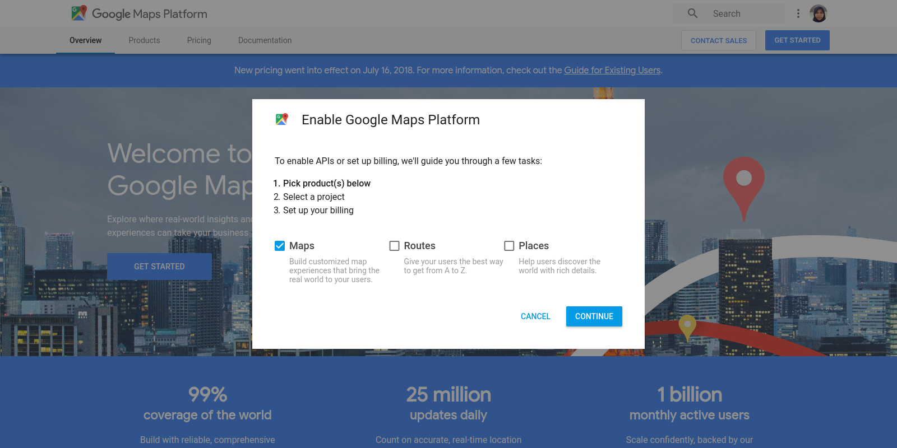
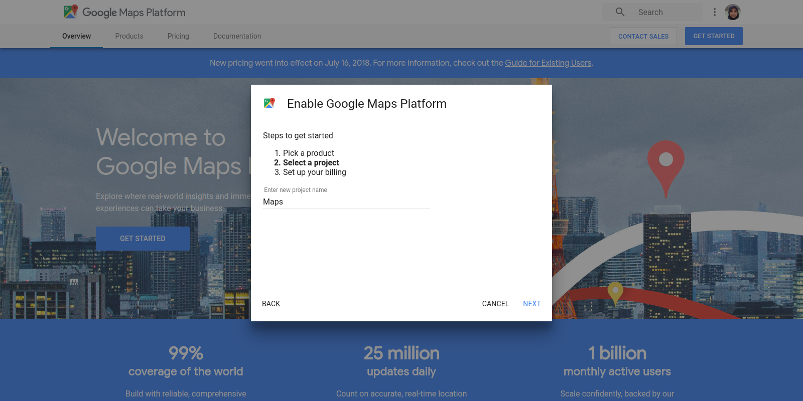
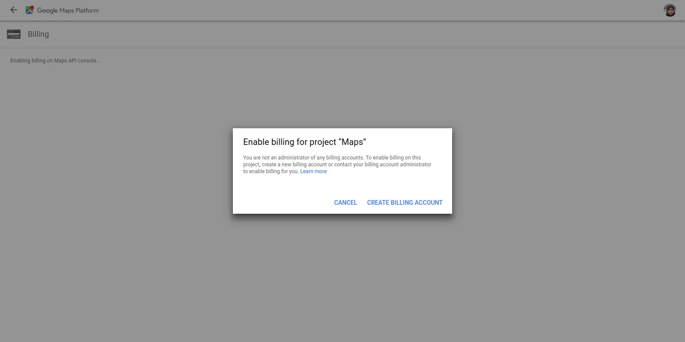
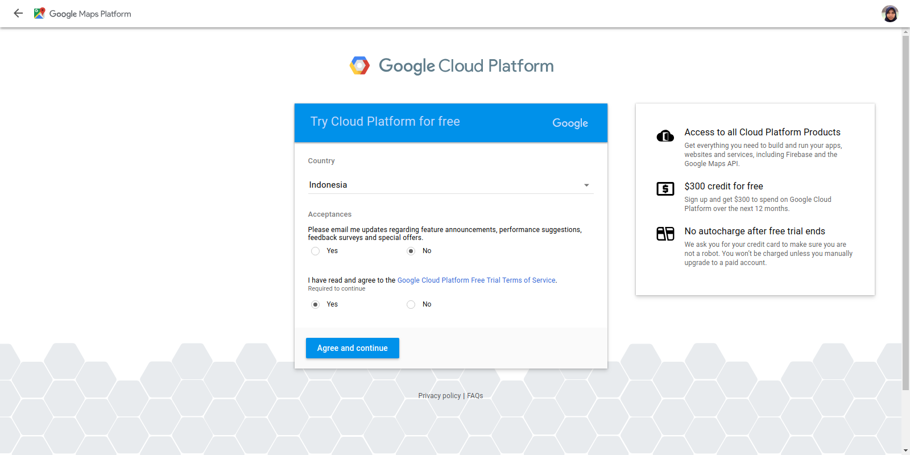
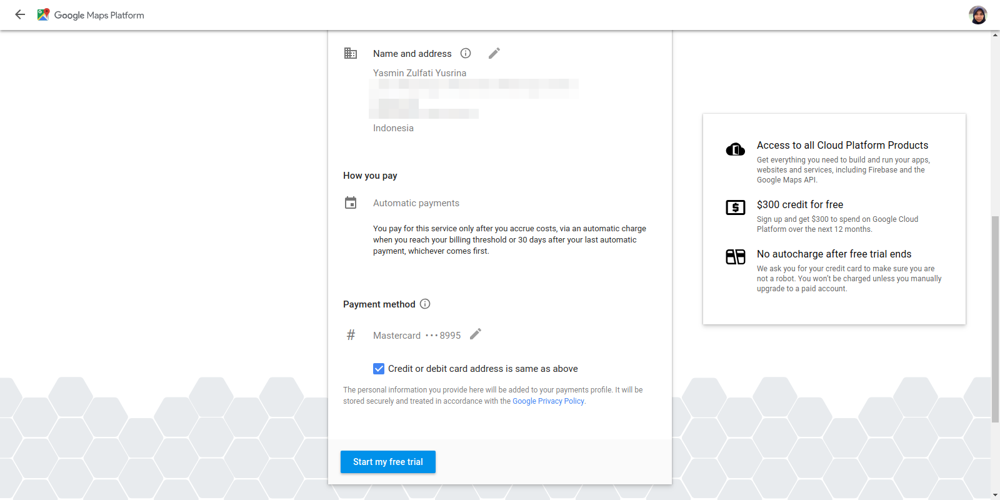
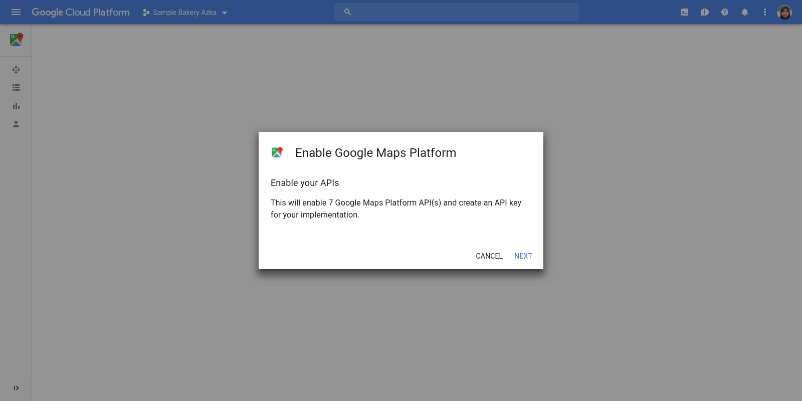
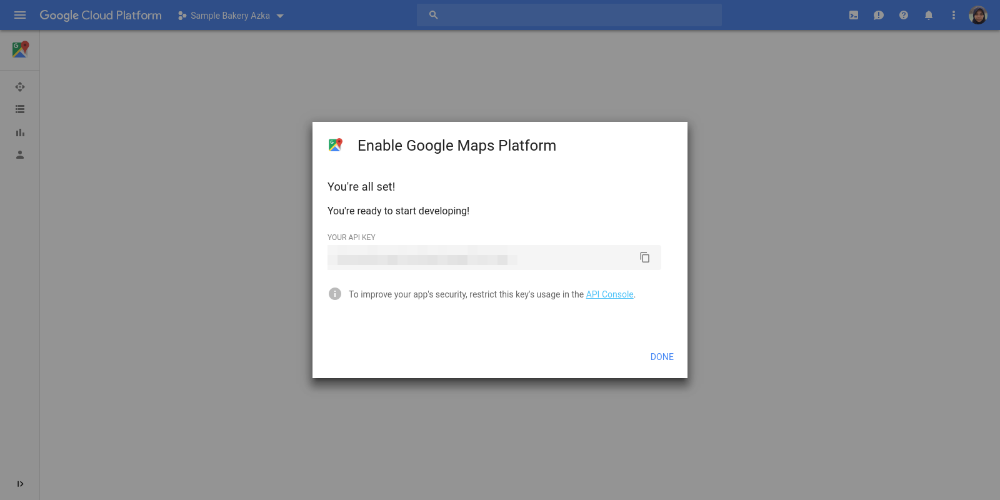

# {{ $page.title }}

<start-tutorial demo="google-maps" lang="id" />

## Mendapatkan API Key

Pertama, dapatkan API key dari [Google Maps Platform](https://cloud.google.com/maps-platform/). Klik **Get Started**.

1.  Pilih produk 

2.  Pilih proyek 

3.  Buat akun billing 

4.  Setujui persyaratan 

5.  Buat profil pembayaran 

6.  Enable API 

7.  Dapatkan API key 

## Instalasi

### Vue

Sekarang, instal [vue-google-maps](https://github.com/xkjyeah/vue-google-maps) dan [dotenv](https://github.com/motdotla/dotenv).

```bash{2}
cd vue-demo
npm i -S vue2-google-maps dotenv
```

Dalam `src/main.js`:

<<< vue-demo/src/main.js{1,15-18}

Setelah itu, buat file bernama `.env` di root proyek dan paste API key-mu. Contohnya:

```env
VUE_APP_GOOGLE_MAPS_API_KEY=ABcdEfGhIjklmNOpqrsTUvWXyzAbcD1EfGhiJKl
```

### Nuxt

Sekarang, instal [vue-google-maps](https://github.com/xkjyeah/vue-google-maps) dan [@nuxtjs/dotenv](https://github.com/nuxt-community/dotenv-module).

```bash{2}
cd nuxt-demo
npm i -S vue2-google-maps @nuxtjs/dotenv
```

Dalam `nuxt.config.js`:

<<< nuxt-demo/nuxt.config.js{17}

Dalam `plugins/vue2-google-maps.js`:

<<< nuxt-demo/plugins/google-maps.js

Setelah itu, buat file bernama `.env` di root proyek dan paste API key-mu. Contohnya:

```env
VUE_APP_GOOGLE_MAPS_API_KEY=ABcdEfGhIjklmNOpqrsTUvWXyzAbcD1EfGhiJKl
```

## Penggunaan

Sekarang kita bisa mulai menambahkan Google Maps.

Dalam `src/views/google-maps.vue` dan `pages/google-maps.vue`:

<<< vue-demo/src/views/google-maps.vue{5-12,20-25}

Kita bisa mengatur posisi tengah peta dengan `center`. Untuk membuat peta menunjukkan gambar yang lebih diperbesar, masukkan angka yang lebih tinggi di `zoom`.

Terdapat empat jenis peta yang bisa kita gunakan di `map-type-id`:

- roadmap
- hybrid
- satellite
- terrain

`gmap-marker` adalah salah satu komponen yang didukung `vue-google-maps`. Dalam contoh ini, kita mempunyai dua lokasi yang ditandai dengan markers.
