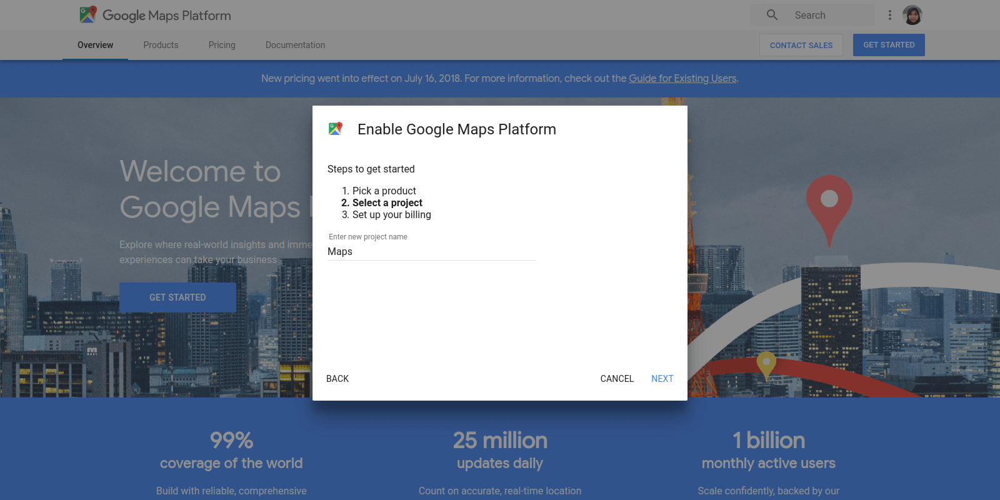

# {{ $page.title }}

<start-tutorial demo="google-maps" />

## Get API Key

First, get an API key from the [Google Maps Platform](https://cloud.google.com/maps-platform/). Click **Get Started**.

1.  Pick a product 

2.  Select a project 

3.  Create a billing account 

4.  Accept the terms of service 

5.  Create a payment profile 

6.  Enable the API 

7.  Get the API key 

## Installation

### Vue

Now, install [vue-google-maps](https://github.com/xkjyeah/vue-google-maps) and [dotenv](https://github.com/motdotla/dotenv).

```bash{2}
cd vue-demo
npm i -S vue2-google-maps dotenv
```

In `src/main.js`:

<<< vue-demo/src/main.js{1,15-18}

After that, create a file named `.env` in the project root and paste your API key. For example:

```env
VUE_APP_GOOGLE_MAPS_API_KEY=ABcdEfGhIjklmNOpqrsTUvWXyzAbcD1EfGhiJKl
```

### Nuxt

Now, install [vue-google-maps](https://github.com/xkjyeah/vue-google-maps) and [@nuxtjs/dotenv](https://github.com/nuxt-community/dotenv-module).

```bash{2}
cd nuxt-demo
npm i -S vue2-google-maps @nuxtjs/dotenv
```

In `nuxt.config.js`:

<<< nuxt-demo/nuxt.config.js{17}

In `plugins/vue2-google-maps.js`:

<<< nuxt-demo/plugins/google-maps.js

After that, create a file named `.env` in the project root and paste your API key. For example:

```env
VUE_APP_GOOGLE_MAPS_API_KEY=ABcdEfGhIjklmNOpqrsTUvWXyzAbcD1EfGhiJKl
```

## Usage

Now we can start embedding Google Maps.

In `src/views/google-maps.vue` and `pages/google-maps.vue`:

<<< vue-demo/src/views/google-maps.vue{5-12,20-25}

We can specify the center of the map with `center`. To make the map zoomed in more, increase the value of `zoom`.

There are four map types we can use for `map-type-id`:

- roadmap
- hybrid
- satellite
- terrain

`gmap-marker` is one of the components supported by `vue-google-maps`. In this example, we have two locations with markers.
